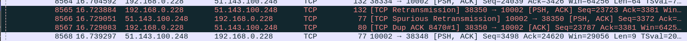

# Redis Retransmit Finder

## Usage

Start a TCP dump

```
cd analysis
sudo tcpdump -i any -s0 -c 10000 -w dump.pcap port 10002
```

Generate some load

```
cd generate
go run generate.go -host redis-10002.test.example.com -port 10002  -password mypassword > out.csv
```

Run the analysis

```
cd analyze
go run analyze.go 
```


## Output

```
cd analyze
$ go run analyze.go 
sequence: 813875362, time_diff: 244 ms, key: 4186, offset: 8565
```

### Correlation
the key can be found in out.csv and show you the timing. for example

```
$ grep 4186 ../generate/out.csv 
4186 291.676831ms
```

### PCAP analysis

The offset number above matches the No. column in wireshark if you wish to use that to analyze



